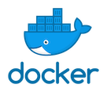

## Pay as you go inference with AWS Lambda (Container Image Support)
  

This repository contains resources to help you deploy Lambda functions based on Python and Java [Docker Images](https://aws.amazon.com/blogs/aws/new-for-aws-lambda-container-image-support/). 

The applications deployed illustrate how to perform inference for scikit-learn, XGBoost, TensorFlow and PyTorch models using Lambda Function.

## Overview

AWS Lambda is one of the most cost effective service that lets you run code without provisioning or managing servers. 

It offers many advantages when working with serverless infrastructure. When you break down the logic of your machine learning service into a single Lambda function for a single request, things become much simpler and easy to scale. 

You can forget all about the resource handling needed for the parallel requests coming into your model. 

**If your usage is sparse and tolerable to a higher latency, Lambda is a great choice among various solutions.**

### Repository Structure

The repository contains the following resources:

- **scikit-learn resources:**  

  - [**Serverless scikit-learn Model Serving**](scikit-learn-inference-docker-lambda):  This examples illustrates how to serve scikit-learn model on Lambda Function to predict based on iris dataset.

- **XGBoost resources:**  

  - [**Serverless XGBoost Model Serving**](xgboost-inference-docker-lambda):  This examples illustrates how to serve XGBoost model on Lambda Function to predict breast cancer.
  - [**Train XGBoost built-in algorithm in SageMaker, inference with AWS Lambda**](xgboost-built-in-algo-train-in-sagemaker-deploy-with-lambda):  This examples illustrates how to target Direct Marketing with Amazon SageMaker XGBoost built-in algorithm. You train the model using SageMaker and inference with AWS Lambda.
  
- **TensorFlow resources:**  

  - [**Serverless TensorFlow Model Serving**](tensorflow-inference-docker-lambda):  This examples illustrates how to serve TensorFlow model on Lambda Function for Object Detection.
  - [**Train a TensorFlow algorithm in SageMaker, inference with AWS Lambda**](tensorflow-train-in-sagemaker-deploy-with-lambda):  This examples illustrates how to use a TensorFlow Python script to train a classification model on the MNIST dataset. You train the model using SageMaker and inference with AWS Lambda.

- **PyTorch resources:**  

  - [**Serverless PyTorch Model Serving**](pytorch-inference-docker-lambda):  This examples illustrates how to serve PyTorch model on Lambda Function for Image Classification.
  - [**Serverless HeBERT Model Serving for sentiment analysis in Hebrew**](hebert-sentiment-analysis-inference-docker-lambda):  This example illustrates how to serve HeBERT model on Lambda Function for sentiment analysis in Hebrew.
        
- **Deep Java Library (DJL) resources:**  

  - [**Serverless Object Detection Model Serving with Deep Java Library (DJL)**](djl-object-detection-inference-docker-lambda):  This example illustrates how to serve TensorFlow Object Detection model on Lambda Function using [Deep Java Library (DJL)](http://djl.ai).
    
  - [**Serverless TensorFlow Lite Image Classification Model Serving with Deep Java Library (DJL)**](djl-tensorflow-lite-inference-docker-lambda):  This example illustrates how to serve TensorFlow Lite Image Classification model on Lambda Function using [Deep Java Library (DJL)](http://djl.ai).

### Installation Instructions

1. [Create an AWS account](https://portal.aws.amazon.com/gp/aws/developer/registration/index.html) if you do not already have one and login.

2. Install [Docker Desktop](https://www.docker.com/products/docker-desktop)

3. [Install the AWS CLI](https://docs.aws.amazon.com/cli/latest/userguide/install-cliv2-mac.html#cliv2-mac-install-gui) and [Configure AWS credentials](https://docs.aws.amazon.com/cli/latest/userguide/cli-configure-quickstart.html#cli-configure-quickstart-config).

4. Clone the repo onto your local development machine using `git clone`.

5. Open the project in any IDE of your choice in order to run the example Python and Java files.

6. Follow the instructions in each of the example README.md file.

## Questions?

Please contact [@e_sela](https://twitter.com/e_sela) or raise an issue on this repo.

## License

This library is licensed under the MIT-0 License. See the LICENSE file.

